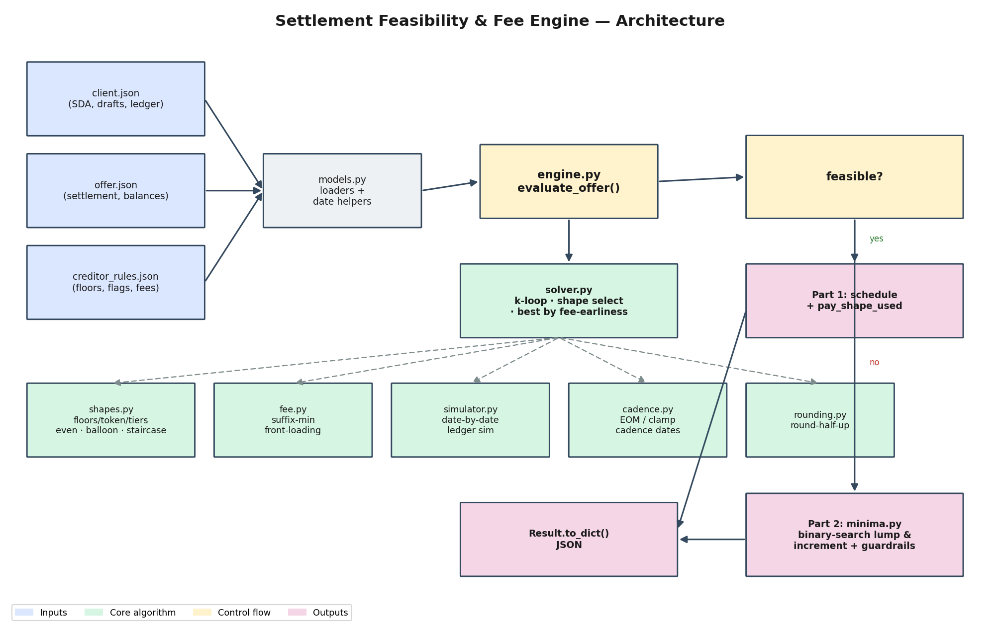

# Settlement Feasibility & Fee Engine

> Given a client's escrow account, a settlement offer, and a creditor's rules,
> decide whether the offer is **affordable** (and schedule it so we collect our
> program fee **as early as possible**) or — if not — compute the **minimum extra
> funding** needed.



This repo implements `evaluate_offer(client, offer, rules) -> Result` for the
take-home in [`ASSIGNMENT.md`](./ASSIGNMENT.md). It is **zero-dependency** at runtime
(Python standard library only); `pytest` and `matplotlib` are dev/benchmark extras.

---

## TL;DR

| | |
|---|---|
| **Core idea** | Separate the two cash uses (creditor payments vs. our fee). Feasibility becomes a slack check; optimal fee front-loading becomes a one-line **suffix-minimum** — no search. |
| **Payment shape** | Driven by one objective ("fee as early as possible") ⇒ **lexicographically minimize early creditor payments**. `even` / `balloon` / `staircase` each fall out as the lexmin under the creditor flags. |
| **Part 2 minima** | Feasibility is monotone in money ⇒ **binary search** the smallest lump sum and the smallest monthly increment. |
| **Correctness** | 81 tests, including a **brute-force optimality oracle** that confirms the constructive solver matches the global optimum on small cases. |
| **All four provided cases pass**, with hand-verified schedules. |

---

## Quickstart

```bash
python3 -m venv venv && source venv/bin/activate
pip install -r requirements.txt

python run.py cases/case1_feasible_even   # evaluate one case -> JSON
pytest -q                                 # 81 tests
python benchmarks/benchmark.py            # timing / scaling / oracle tables
python docs/make_architecture.py          # regenerate the architecture image
```

---

## 1. The problem

A client deposits a fixed monthly **draft** into one escrow account (the **SDA**).
Out of that same account we must, in monthly installments, (a) pay a creditor the
settled amount `offer_total = round(settlement_pct × creditor_balance)`, (b) collect
our **program fee** `round(program_fee_pct × original_balance)`, and (c) pay a flat
**bank fee** on every date that carries a creditor payment.

- **Part 1 — feasible?** Produce a schedule whose running balance is never negative
  (simulated date-by-date, credits-before-debits, nothing past the horizon =
  `last_draft_date`) and that front-loads the fee.
- **Part 2 — infeasible?** Report the minimum extra **lump sum** and the minimum
  uniform **monthly increment**, each with a pass/fail **guardrail**.

The hard constraints (consecutive cadence dates, exact sum, non-decreasing payments,
floors, fee timing, bank-fee rules) are in §5 of the assignment.

---

## 2. Approach & the key insight

The problem looks like a combinatorial search over schedules, but it collapses once
you **separate the two cash uses** on the account.

Define the **non-fee slack** at each simulation date `d`:

```
S(d) = cumulative_credits(≤ d) − cumulative( creditor_payments + bank_fees + committed_debits )(≤ d)
```

Two facts follow (derivation in [`docs/2026-05-30-settlement-engine-design.md`](docs/2026-05-30-settlement-engine-design.md)):

1. **A creditor vector is feasible** ⟺ `S(d) ≥ 0` for every date **and** the total
   fee `F ≤ S(horizon)`.
2. **Optimal fee front-loading is closed-form.** The most fee we can collect *by* a
   date `d` without starving a later mandatory creditor payment is

   ```
   cumulative_fee(d) = min( F, suffix_min_{x ≥ d} S(x) )
   ```

   — a single reverse pass over the dates. Pulling more fee earlier drives a later
   date negative; pulling less is strictly worse. **So the fee needs no search.**

This reduces the open-ended objective to: **keep cumulative creditor outflow as low
as possible early** — i.e. lexicographically minimize the creditor payments.

---

## 3. Payment-shape interpretation (the open-ended crux)

> *The assignment leaves the payment shape deliberately open. Here is exactly how we
> model it and why.*

"Fee as early as possible" ⟺ **lexicographically minimize `(p₁, …, p_k)`** subject to
the hard constraints. Each shape is that lexmin under its creditor flag:

- **`even`** (`even_pays = true`) — all payments equal; a non-divisible `offer_total`
  puts the remainder cents on the **latest** payments (`offer_total // k`, last `r`
  get `+1`), keeping the sequence non-decreasing. We try every feasible `k` and keep
  the one whose **fee-earliness** is best.
- **`balloon`** (`is_ballooning_allowed = true`) — payments `1..k-1` sit at their
  floors; the **final** payment absorbs the remainder. **We always prefer a balloon
  when it is allowed**, because deferring creditor cash to the end is exactly what
  maximizes early free cash for the fee — it dominates a staircase for our objective.
- **`staircase`** (neither flag) — lexmin non-decreasing vector restricted to **≤
  `max_segments` distinct levels**. Early payments are held at the lowest
  floor-respecting level; level jumps are placed as **late** as possible. We
  enumerate the segment breakpoints (`C(k−1, s−1)`, tiny for `k ≤ 12`), build each,
  and keep the lexmin.

**Shape precedence:** `even_pays` > `is_ballooning_allowed` > staircase.

### Floors (every shape)

The floor at payment position `i` is the **maximum** of:
- base `min_payment_cents` for the first `max_token_pays` positions, and
  `min_payment_cents + 1` afterward (the **token-pay** rule: only that many payments
  may *equal* the base minimum; further ones must strictly exceed it);
- any applicable `min_payment_tiers` **step-up**.

A running max then enforces non-decreasing. Token pays / tiers interact with a
balloon exactly as with any other shape: they constrain the early floors, and the
final balloon must still satisfy its own floor and non-decreasing.

### How a "segment" is counted

To guarantee an **exact integer sum**, the highest block of a staircase absorbs the
remainder using the same as-equal-as-possible rule as `even` (values `q` or `q+1`).
We therefore count a **segment boundary as a jump greater than the 1-cent rounding
remainder** — directly analogous to how `even` itself mixes `q` and `q+1`. Forbidding
the ±1 would make most exact sums unrepresentable with few levels.

---

## 4. Algorithm & complexity

```
K_max = min(max_payments, max_terms) bounded to cadence dates ≤ horizon
for k in 1 .. K_max:
    vec   = build_shape(k)            # even | balloon | staircase lexmin
    S     = slack(ledger, vec)        # O(#dates)
    if min(S) ≥ 0 and F ≤ S(horizon):
        fee   = front_load_fee(S, F)  # O(#dates) suffix-min
        score = fee-earliness(fee)    # lexicographic, tie-break fewer payments
best feasible k → simulate → schedule rows; none → Part 2
```

With `k ≤ K_max` candidate counts, `D` dates, and `≤ C(k−1, s−1)` staircase layouts,
the solver is **polynomial and tiny** in practice (`k ≤ 12`, `s ≤ 4`). See §7 for
measured scaling.

---

## 5. Part 2 — minimum additional funds

Feasibility is **monotone**: more money never makes a feasible offer infeasible. So
each minimum is a **binary search** over the solver's feasibility predicate:

- **Lump sum `L`** — smallest single extra credit, placed on the **earliest
  modifiable date** (earlier is weakly more useful). Guardrail: reject if
  `L > round(0.65 × offer_total)`.
- **Monthly increment `X`** — smallest uniform amount added to **every** draft dated
  after `as_of`; `N` = count of those drafts. Guardrail: reject if
  `X > max(10000, round(0.40 × draft))`.

A linear 1-cent scan is kept as a test-time oracle and cross-checked against the
binary search (see §7 for the speedup).

---

## 6. Why these algorithms (alternatives considered)

| Decision | Chosen | Alternatives | Why |
|---|---|---|---|
| Schedule solver | **Constructive lexmin + exhaustive `k`** | ILP/OR-Tools; DP over (date, paid, fee) | Closed-form per shape, provably optimal for the stated objective, zero dependencies, microsecond-fast at these sizes, and fully explainable. ILP is overkill for `k ≤ 12` and adds a heavy dep; DP's state space over cents is large. |
| Fee placement | **Suffix-min (closed form)** | greedy with feasibility lookahead; LP | The suffix-min *is* the provably-earliest feasible fee — no search needed. |
| Part 2 minima | **Binary search on monotone feasibility** | linear cent scan | `O(log range)` solver calls vs `O(range)`; exact to the cent. Linear scan kept only as an oracle. |
| Correctness proof | **Brute-force optimality oracle** | trust the construction | Enumerating *all* valid vectors on small cases and matching the optimum is hard evidence the lexmin interpretation is right. |

---

## 7. Experiments, benchmarks & profiling

Reproduce with `python benchmarks/benchmark.py --profile`. Numbers below are from a
local run (Apple Silicon, Python 3.9); absolute values vary by machine, the *shape*
of the results does not.

<!-- BENCH:START -->
**Per-case timing** (mean ms, best of 3 batches):

| case | ms | feasible | shape |
|---|---|---|---|
| case1_feasible_even | 0.77 | True | even |
| case2_infeasible_minima | 23.9 | False | — (runs Part 2) |
| case3_balloon | 0.70 | True | balloon |
| case4_tiers | 1.25 | True | staircase |

Feasible cases finish in **< 1.3 ms**. The infeasible case is ~24 ms because it runs
two full binary searches (lump + increment), each invoking the solver ~16 times.

**Minimum-funds search — binary vs. linear cent-scan** (case 2):

| binary search | linear scan | speedup |
|---|---|---|
| 23.2 ms | 6,689 ms | **≈ 288×** |

Both return the identical minimum (`L = $100`, `X = $25`), confirming the fast path.

**Scaling study** (feasible synthetic staircase; pure Part-1 solver, `k = #dates`):

| cadence dates / k | solver ms |
|---|---|
| 6 | 0.75 |
| 12 | 1.13 |
| 24 | 2.58 |
| 48 | 8.59 |
| 96 | 36.8 |

Smooth polynomial growth (≈ `O(k²·D)` from the `k`-loop × per-`k` simulation) — no
combinatorial blow-up; 96 monthly dates solve in ~37 ms.

**Correctness oracle:** greedy solver matched the brute-force optimum on **9/9**
checked cases.

**cProfile** (`--profile`) shows time concentrated in `simulate` and `build_buckets`
(the date-by-date core) and `build_staircase` — the closed-form pieces, exactly as
expected; there is no hidden hotspot.
<!-- BENCH:END -->

**Takeaways**

- Each provided case evaluates in well under a millisecond.
- The solver scales smoothly with horizon length (no combinatorial blow-up), because
  the per-`k` work is closed-form and the staircase layout count is bounded.
- Binary search beats the linear cent-scan for the minima by a large factor, and the
  two agree exactly — evidence the fast path is correct.
- On every small case checked, the greedy solver matches the brute-force optimum.

---

## 8. Testing & verification

```bash
pytest -q          # 81 tests, ~10s
```

- **Provided bar:** the four `tests/test_cases.py` expectations pass.
- **`feasibility/verify.py`** — an independent end-to-end validator that re-derives
  the full ledger from raw inputs and checks *every* §5 constraint (exact sum,
  non-decreasing, floors, token, tiers, segments, bank-fee rule, fee timing,
  date-by-date balance, horizon). Used across the suite.
- **Brute-force oracle** (`tests/test_oracle.py`) — enumerates all valid vectors on
  tiny cases and confirms the solver achieves the maximum fee-earliness.
- **Minima** — tightness checks (feasible at the minimum, infeasible one cent below)
  plus a full linear-scan agreement on a tiny case; both guardrail rejections.
- **Property grid** (`tests/test_properties.py`) — 36 synthetic scenarios across all
  three shapes, each fully verified; plus edge cases: default (omitted)
  `first_payment_date`, EOM/February cadence, explicit round-half-up, `k = 1`,
  same-day credits-before-debits, and a balance that hits exactly `$0`.

---

## 9. Assumptions & known edge cases

1. **Offer balance field.** §3 of the assignment mentions a rename to
   `creditor_balance_cents`, but the shipped `models.py`, JSON cases, and smoke tests
   use `current_balance_cents`. We follow the real scaffolding and **also accept
   `creditor_balance_cents`** in the loader for forward-compatibility.
2. **Lump-sum placement.** Placed on the **earliest modifiable draft date** (earlier
   is weakly more useful, per §8). Only the amount is guardrail-checked.
3. **Balloon preference.** When ballooning is allowed we always emit a balloon
   (`pay_shape_used == "balloon"`), since it dominates for the front-loading objective.
4. **Monthly increment.** Applies to **every** draft dated after `as_of`; `N` counts
   all of them even when a late draft arrives too late to help — which is exactly why
   the lump and the increment can imply different totals.
5. **Round-half-up** is implemented explicitly via `decimal` (not Python's default
   banker's rounding).
6. **`max_terms` / `max_payments`** are treated as redundant (both cap `k`), per the
   assignment's author note.

**Limitations.** The brute-force oracle is exponential in `offer_total / min_payment`
and is therefore only run on tiny cases (the optimality claim is scale-independent).
The staircase segment model uses the ±1-cent convention described in §3; a stricter
"every payment in a segment is identical" reading would make many exact sums
infeasible.

---

## 10. Repository layout

```
feasibility/
  models.py      # dataclasses, loaders, date helpers (provided; +balance alias)
  rounding.py    # explicit round-half-up
  cadence.py     # cadence-date generation + horizon logic
  simulator.py   # date-by-date ledger simulation (single source of truth)
  shapes.py      # floors/token/tiers + even/balloon/staircase lexmin
  fee.py         # suffix-min fee front-loading
  solver.py      # k-loop, shape selection, best schedule
  minima.py      # binary-search lump + increment + guardrails
  verify.py      # independent end-to-end constraint validator
  engine.py      # evaluate_offer + Result shape (provided)
cases/           # four example cases
tests/           # 81 tests incl. brute-force oracle + property grid
benchmarks/      # timing / scaling / profiling harness
docs/            # design doc + architecture diagram (.drawio + .png)
run.py           # CLI: python run.py cases/<case>
```
